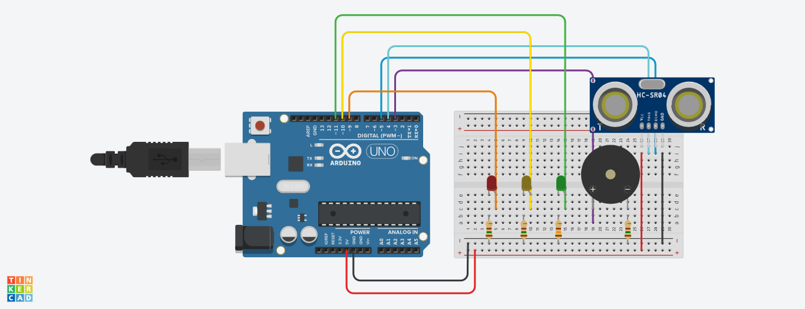

# Detector-Proximidade

## Definição
Montar um projeto que implemente hardware e software com um Arduino ou uma ESP32.
Fizemos um detector de proximidade, similar a um alarme de ré de um  carro.

## Componentes
| Quantidade      | Componente              | Valor   |
| --------------- | ----------------------- | ------- |
| 1x              | LED Vermelho            | R$1,00  |
| 1x              | LED Amarelo             | R$1,00  |
| 1x              | LED Vermelho            | R$1,00  |
| 4x              | Resistor 150 ohms       | R$0,70  |
| 1x              | Buzzer Ativo 20         | R$10,00 |
| 12x             | Jumpers Macho-Macho     | R$9,00  |
| 1x              | Protoboard              | R$21,00 |
| 1x              | Arduino                 | R$0,00  |
| 1x              | Sensor Ultrassônico     | R$16,00 |
| TOTAL           |                         | R$59,70 |

- LED

   Acendem conforme algo se aproxima do sensor ultrassônico. O LED verde acende quando for detectado algo a 50cm de distância do sensor. O LED amarelo acende quando algo for detectado a 25cm e o vermelho acende quando algo for detectado a menos de 10cm.
   Dois LEDS não são acesos ao mesmo tempo.

- RESISTOR

   Limita a corrente que passa pelos componentes para não queimá-los.

- BUZZER

   Emite um barulho mais ou menos intenso conforme a distância detectada.

- SENSOR ULTRASSÔNICO

   Emite um som e recebe sua reflexão de volta, armazenando o intervalo de tempo entre a emissão e a recepção.

- ARDUINO

    Permite o controle dos componentes, recebendo suas saídas e coordenando suas entradas. É responsável pela realização dos cálculos que convertem o intervalo de tempo entre sinais na distância do objeto ao sensor.


## Circuito
#### Tinkercad: https://tinyurl.com/39wv7hju



## Código
```Arduino
// Leds
#define greenLed 11
#define yellowLed 10
#define redLed 9
// Pinos - Sensor Ultrassônico
#define pinTrigger 4
#define pinEcho 5
// Buzzer
#define soundBuzzer 3
int sound = 500;

void setup() {
   Serial.begin(9600);
   pinMode(greenLed, OUTPUT);
   pinMode(yellowLed, OUTPUT);
   pinMode(redLed, OUTPUT);
   pinMode(pinTrigger, OUTPUT);
   pinMode(pinEcho, INPUT);
   pinMode(soundBuzzer, OUTPUT);
}

void loop() {
    long duration, cmDistance;

   // Lançamento da onda
    digitalWrite(pinTrigger, LOW); 
    delay(2);
    digitalWrite(pinTrigger, HIGH);
    delay(10);
    digitalWrite(pinTrigger, LOW);
   
   // Recebimento do tempo que levou para a onda ir e voltar, 
   // e a conversão para cm
    duration = pulseIn(pinEcho, HIGH);
    cmDistance = (duration/58);
  
   // Função tone(pinoBuzzer, som) - Tocar o buzzer 
 
    if (cmDistance <= 50 && cmDistance > 25) {
      digitalWrite(greenLed, HIGH);
      digitalWrite(yellowLed, LOW);
      digitalWrite(redLed, LOW);
      noTone(soundBuzzer);
    }
    else if (cmDistance <= 25 && cmDistance > 10) {
      digitalWrite(greenLed, LOW);
      digitalWrite(redLed, LOW);
      digitalWrite(yellowLed, HIGH);
      noTone(soundBuzzer);
      delay(500);
      sound = 500;
      tone(soundBuzzer, sound);
      digitalWrite(yellowLed, LOW);
    }
    else if (cmDistance <= 10) {
      digitalWrite(greenLed, LOW);
      digitalWrite(yellowLed, LOW);

      sound = 1000;
      tone(soundBuzzer, sound);
      digitalWrite(redLed, HIGH);
      delay(500);
      digitalWrite(redLed, LOW);
    }
    else {
      digitalWrite(redLed,LOW);
      noTone(soundBuzzer);
    }
  
  delay(1000);
}
```


## Vídeo
https://www.youtube.com/watch?v=H0zxSMPzldY

## Alunos
- Alec Campos Aoki - 15436800
- Pedro Augusto Ferraro Paffaro - 15483380
- João Pedro Castelli - 15463450
- Marcelo Martins Conti - 15474629